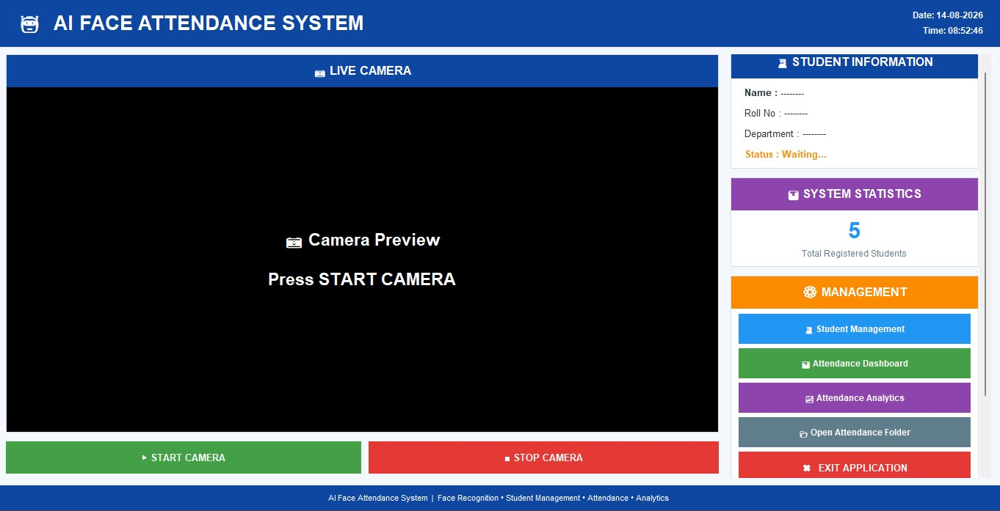

# 🤖 AI Face Attendance System

An AI-powered Face Attendance System built using Python, OpenCV, Face Recognition, Tkinter, Pandas, and Excel.

The system automatically recognizes registered students through a webcam and records their attendance while preventing duplicate attendance for the same student on the same day.

---

## 🖥️ Project Dashboard



---

## 📌 Project Overview

The AI Face Attendance System is a computer-vision-based attendance management application designed to automate the traditional attendance process.

Instead of manually recording attendance, the system detects and recognizes registered students using facial recognition and automatically records their attendance in an Excel file.

The application also provides student management, face encoding, attendance analytics, and a graphical dashboard.

---

## ✨ Features

- 👤 Real-time face recognition
- 📷 Live webcam attendance
- ✅ Automatic attendance marking
- 🚫 Duplicate attendance prevention
- 👨‍🎓 Student registration
- 🧑‍💼 Student management
- 🔍 Student search
- 🧠 Face encoding
- 📊 Attendance dashboard
- 📈 Attendance analytics
- ✅ Present/Absent statistics
- 📊 Attendance percentage
- 📁 Excel attendance records
- 💾 Attendance backup and cleaning
- 🔄 Face encoding updates when new students are registered
- 🖥️ Tkinter graphical user interface

---

## 🛠️ Technologies Used

| Technology | Purpose |
|---|---|
| Python | Main programming language |
| OpenCV | Camera and image processing |
| Face Recognition | Facial recognition |
| dlib | Face recognition processing |
| NumPy | Numerical operations |
| Pandas | Attendance data processing |
| OpenPyXL | Excel file management |
| Pillow | Image processing and GUI images |
| Tkinter | Graphical user interface |
| Matplotlib | Analytics and visualization |
| JSON | Student information storage |
| Excel | Attendance records |

---

## 📁 Project Structure

```text
Face_attendance_system/
│
├── assets/
├── attendance/
├── encodings/
├── images/
├── utils/
│
├── main.py
├── camera.py
├── attendance.py
├── students.py
├── encode_face.py
├── analytics.py
├── dashboard.py
├── student_management.py
├── register_face.py
│
├── students.json
├── requirements.txt
└── README.md
